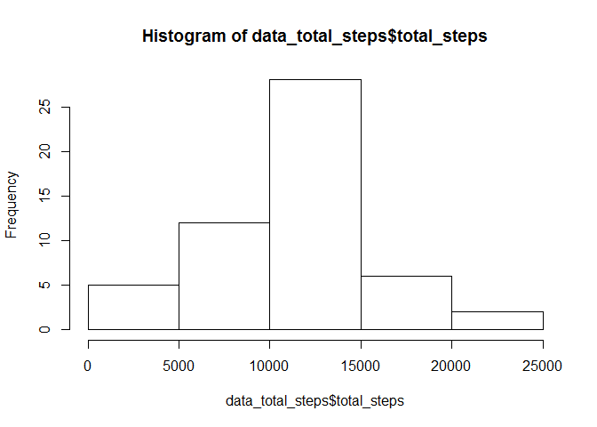
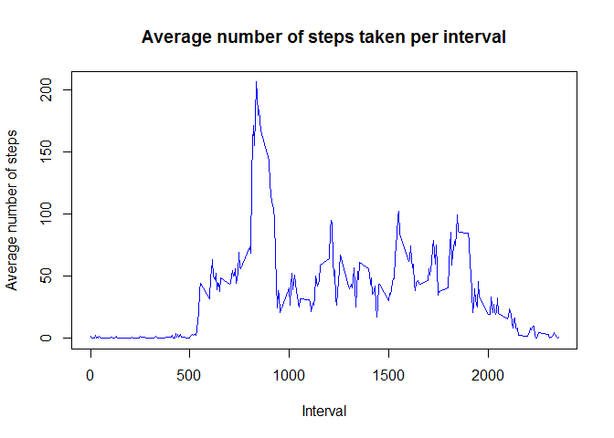
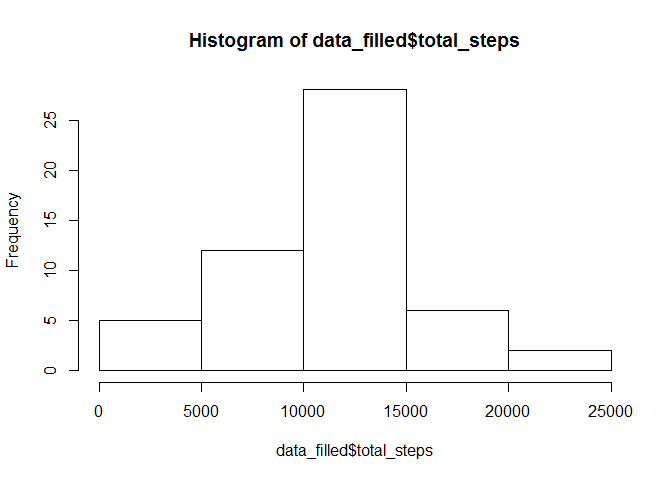

# Reproducible Research: Peer Assessment 1


## Loading and preprocessing the data


```r
data <-read.csv ("activity/activity.csv")
data$date <- as.Date(data$date)
```


## What is mean total number of steps taken per day?

```r
library(dplyr)
```

```
## 
## Attaching package: 'dplyr'
## 
## The following object is masked from 'package:stats':
## 
##     filter
## 
## The following objects are masked from 'package:base':
## 
##     intersect, setdiff, setequal, union
```

```r
data_total_steps <- summarise(group_by(data, date),total_steps=sum(steps,na.rm=FALSE))
hist(data_total_steps$total_steps)
```

 

```r
mean(data_total_steps$total_steps,na.rm=TRUE)
```

```
## [1] 10766.19
```

```r
median(data_total_steps$total_steps,na.rm=TRUE)
```

```
## [1] 10765
```
## What is the average daily activity pattern?

```r
data_mean_intervals <- summarise(group_by(data, interval),mean_interval=mean(steps,na.rm=TRUE))
        with(data_mean_intervals,plot(interval,mean_interval,type = "l"))
```

 

```r
        with(data_mean_intervals,interval[which.max(mean_interval)])
```

```
## [1] 835
```
## Imputing missing values
Strategy: NA values will be replaced by the mean value already calculated for the Average Daily Activity Pattern

```r
sum(is.na(data$steps))
```

```
## [1] 2304
```

```r
sum(is.na(data$date))
```

```
## [1] 0
```

```r
sum(is.na(data$interval))
```

```
## [1] 0
```

```r
data_all <- inner_join(data,data_mean_intervals)
```

```
## Joining by: "interval"
```

```r
data_filled <- mutate(data_all,steps=ifelse(is.na(steps),mean_interval,steps))
data_filled <- summarise(group_by(data, date),total_steps=sum(steps,na.rm=FALSE))
hist(data_filled$total_steps)
```

 

```r
mean(data_filled$total_steps,na.rm=TRUE)
```

```
## [1] 10766.19
```

```r
median(data_filled$total_steps,na.rm=TRUE)
```

```
## [1] 10765
```
## Are there differences in activity patterns between weekdays and weekends?

```r
library(lubridate)
data<-mutate(data,day=as.factor(ifelse(wday(date) %in% c(1,7),"weekend","weekday")))
data_day_interval<- summarise(group_by(data,day,interval), meansteps=mean(steps,na.rm=TRUE))
library(lattice)
with (data_day_interval, 
      xyplot(meansteps ~ interval|day, type="l", 
             ylab="Number of steps",layout=c(1,2)))
```

 


