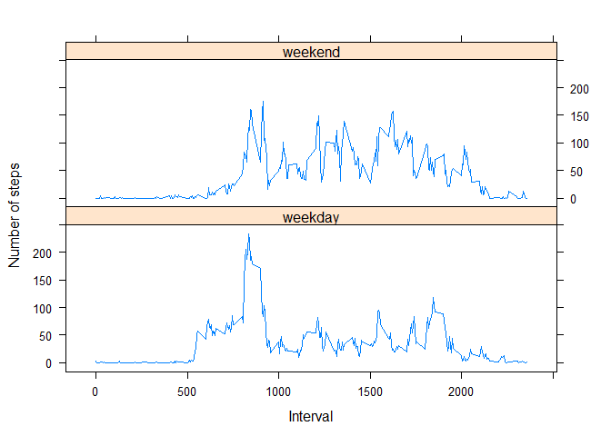

# Reproducible Research: Peer Assessment 1


## Loading and preprocessing the data

1- Loading Data

```r
data <-read.csv ("activity/activity.csv")
```

2- Processing the date in the data

```r
data$date <- as.Date(data$date)
```

## What is mean total number of steps taken per day?


```r
library(dplyr)
```
1- Calculate the total number of steps taken per day

```r
steps_taken_per_day <- summarise(group_by(data, date),total_steps=sum(steps, na.rm=TRUE))
```

2- Histogram of the total number of steps taken each day

```r
hist(steps_taken_per_day$total_steps,main='Total number of steps taken per day',xlab='Steps per day',col='red')
```

 
  
3- Calculate and report the mean and median of the total number of steps taken per day

```r
mean1 <- mean(steps_taken_per_day$total_steps,na.rm=TRUE);pmean1 <- formatC(mean1,format='d')
median1 <- median(steps_taken_per_day$total_steps,na.rm=TRUE);pmedian1 <- formatC(median1,format='d')
```
- The **mean** total number of steps taken per day is **9354**. 
- The **median** total number of steps taken per dayis **10395**.

## What is the average daily activity pattern?

1- Make a time series plot (i.e. type = "l") of the 5-minute interval (x-axis) and the average number of steps taken, averaged across all days (y-axis)

```r
average_steps_per_interval <- summarise(group_by(data,interval),average_per_interval=mean(steps,na.rm=TRUE))
with(average_steps_per_interval,plot(interval,average_per_interval,type = "l",main='Average number of steps taken per interval',xlab='Interval',ylab='Average number of steps',col='blue'))
```

 

2- Which 5-minute interval, on average across all the days in the dataset, contains the maximum number of steps?

```r
maximum <- with(average_steps_per_interval,interval[which.max(average_per_interval)])
```
The interval which contains the **maximum** number of steps is **835**.

## Imputing missing values

1- Calculate and report the total number of missing values in the dataset

```r
missing_values  <-  sum(is.na(data$steps))
```
Total number of **missing values** in the dataset is **2304**.

2- **Strategy**: NA values will be replaced with the mean value for each corresponding 5-minute interval.

3- Create a new dataset that is equal to the original dataset but with the missing data filled in.

```r
data_all <- inner_join(data,average_steps_per_interval)
data_filled <- mutate(data_all,steps=ifelse(is.na(steps),average_per_interval,steps))
data_filled <- select(data_filled,-average_per_interval)
```

4- Make a histogram of the total number of steps taken each day and Calculate and report the mean and median total number of steps taken per day.

```r
data_filled <- summarise(group_by(data_filled, date),total_steps=sum(steps))
hist(data_filled$total_steps,main='Total number of steps taken per day',xlab='Steps per day',col='green')
```

 

```r
mean2 <- mean(data_filled$total_steps,na.rm=TRUE);pmean2 <- formatC(mean2,format='d')
median2 <- median(data_filled$total_steps,na.rm=TRUE);pmedian2 <- formatC(median2,format='d')
```
- The **mean** total number of steps taken per day is **10766**. 
- The **median** the total number of steps taken per dayis **10766**.

After inputting missing data, besides mean and median are equal, estimates of total number of steps show positive differences:


```r
mean_difference <- mean2 - mean1;pmean_difference <- formatC(mean_difference,format='d')
median_difference <- median2 - median1;pmedian_difference <- formatC(median_difference,format='d')
```
- **Mean** difference is **1411**.
- **Median** difference is **371**.

## Are there differences in activity patterns between weekdays and weekends?

1- Create a new factor variable in the dataset with two levels - "weekday" and "weekend" indicating whether a given date is a weekday or weekend day.

```r
library(lubridate)
data_weekly<-mutate(data,day=as.factor(ifelse(wday(date) %in% c(1,7),"weekend","weekday")))
```

2- Make a panel plot containing a time series plot (i.e. type = "l") of the 5-minute interval (x-axis) and the average number of steps taken, averaged across all weekday days or weekend days (y-axis).

```r
data_day_interval<- summarise(group_by(data_weekly,day,interval), average=mean(steps,na.rm=TRUE))
library(lattice)
with (data_day_interval, 
      xyplot(average ~ interval|day, type="l", 
             ylab="Number of steps",xlab='Interval',layout=c(1,2)))
```

 
